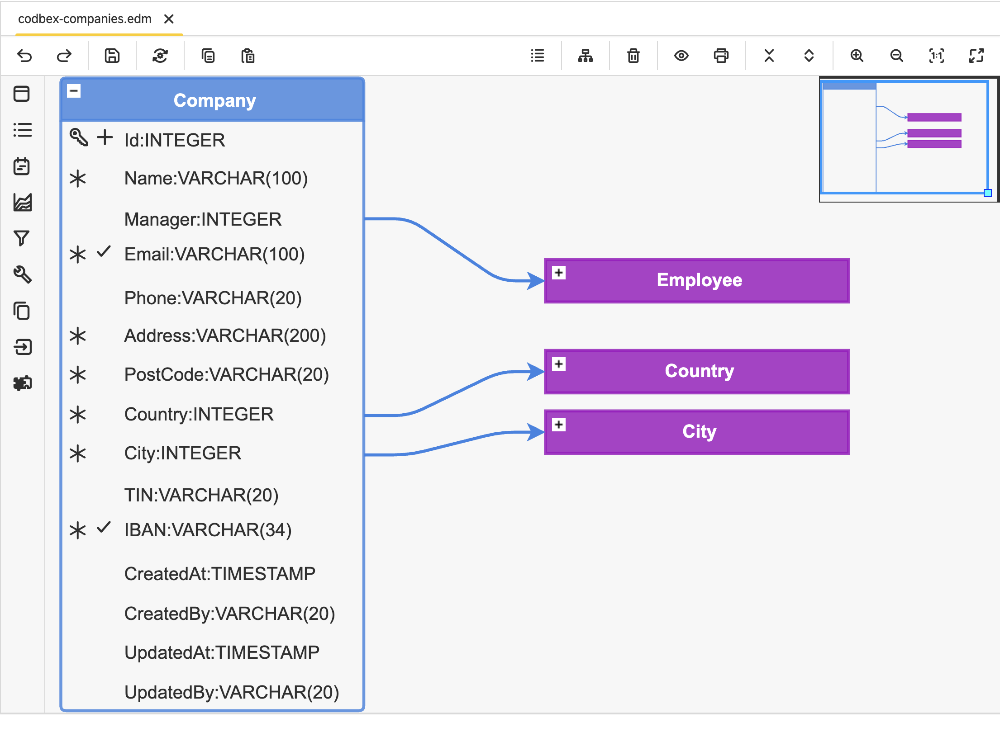

#  codbex-companies

## 📖 Table of Contents
* [🗺️ Entity Data Model (EDM)](#️-entity-data-model-edm)
* [🧩 Core Entities](#-core-entities)
* [📦 Dependencies](#-dependencies)
* [🐳 Local Development with Docker](#-local-development-with-docker)

## 🗺️ Entity Data Model (EDM)



## 🧩 Core Entities

### Entity: `Company`

| Field     | Type      | Details                      | Description                                  |
|-----------| --------- |------------------------------| -------------------------------------------- |
| Id        | INTEGER   | PK, Identity                 | Unique identifier for the company            |
| Name      | VARCHAR   | Length: 100, Not Null        | Name of the company                          |
| Manager   | INTEGER   | Nullable, FK                 | References employee (manager of the company) |
| Email     | VARCHAR   | Length: 100, Unique, Not Null | Company email                                |
| Phone     | VARCHAR   | Length: 20, Nullable         | Company phone number                         |
| Address   | VARCHAR   | Length: 200, Not Null        | Company address                              |
| PostCode  | VARCHAR   | Length: 20, Not Null         | Postal code                                  |
| Country   | INTEGER   | Not Null, FK                 | References country                           |
| City      | INTEGER   | Not Null, FK                 | References city                              |
| TIN       | VARCHAR   | Length: 20, Nullable         | Tax identification number                    |
| IBAN      | VARCHAR   | Length: 34, Unique, Not Null | Company IBAN                                 |
| CreatedAt | TIMESTAMP | Audit                        | Timestamp when the entry was created.                       |
| CreatedBy | VARCHAR   | Audit, Length: 20        | User who created the entry.                             |
| UpdatedAt | TIMESTAMP | Audit                     | Timestamp when the entry was updated.                       |
| UpdatedBy | VARCHAR   | Audit, Length: 20         | User who updated the entry.                              |

## 📦 Dependencies

- [codbex-countries](https://github.com/codbex/codbex-countries)
- [codbex-cities](https://github.com/codbex/codbex-cities)
- [codbex-employees](https://github.com/codbex/codbex-employees)
- [codbex-navigation-groups](https://github.com/codbex/codbex-navigation-groups)

## 🐳 Local Development with Docker

When running this project inside the codbex Atlas Docker image, you must provide authentication for installing dependencies from GitHub Packages.
1. Create a GitHub Personal Access Token (PAT) with `read:packages` scope.
2. Pass `NPM_TOKEN` to the Docker container:

    ```
    docker run \
    -e NPM_TOKEN=<your_github_token> \
    --rm -p 80:80 \
    ghcr.io/codbex/codbex-atlas:latest
    ```

⚠️ **Notes**
- The `NPM_TOKEN` must be available at container runtime.
- This is required even for public packages hosted on GitHub Packages.
- Never bake the token into the Docker image or commit it to source control.
